## Resistor
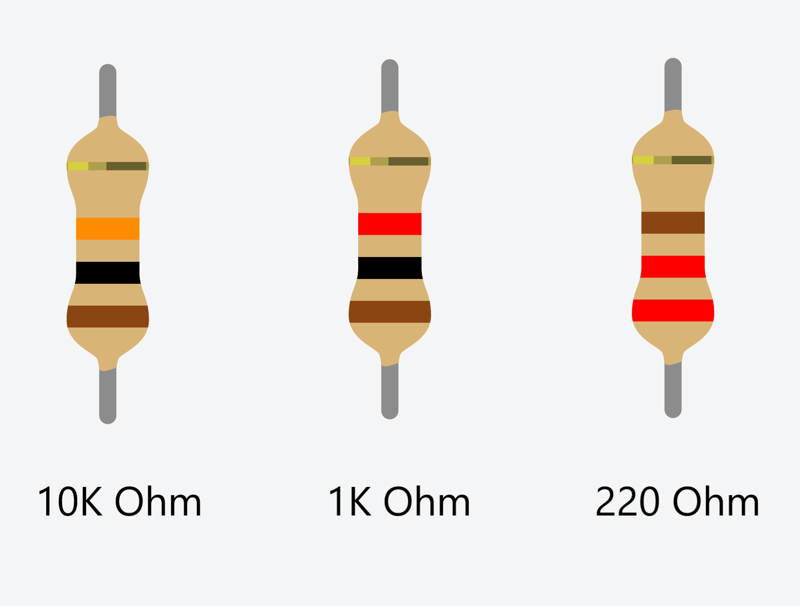

In electronic circuits, resistors are used to reduce current flow, adjust signal levels, to divide voltages, bias active elements, and terminate transmission lines, among other uses.

## LED

Light Emiting Diode is a component that emits light.

## Push Button switches

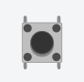

Push button switches come in 2 varieties, momentary and push-on/push-off

## Slide/Toggle On/Off switches

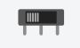

Slide/Toggle switches are components that when activated are either on or off. Their levers have to physically moved to engage whether the position.

## Potentiometer

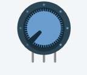

Potentiometer is a sensor whose resistance changes based on rotating its knob/shaft.

## Photoresistor

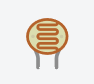

Photoresistor is a light sensor whose resistance changes based on light.

## Temperature Sensor

Temperature Sensor is sensor the returns the current temperature.

## Gas Sensor

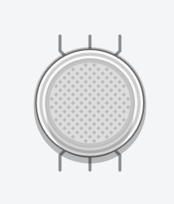

Gas Sensor is sensor the returns the amount of a particular gas is in the current atmosphere. These sensors range from CO2, Methane, to other gases.

## Tilt Switch

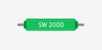

Tilt Switch is a switch that only engages when you tilt the component. Unlike a Accelerometer/Gyroscope it is binary meaning it is on or off.

## Accelerometer/Gyroscope

This sensor is used for the detection of movement and tilt and returns the range of movement and tilt.

## DC Motor
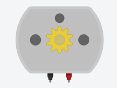

A motor generally used for continuous motion. Like an RC car.

## Vibration Motor
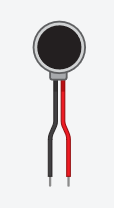

A motor generally used for haptic feedback. Like in a cellphone.

## Servo Motor
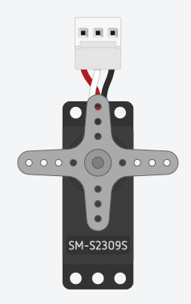

Servo Motor is a motor generally use for positioning

## Piezo Speaker
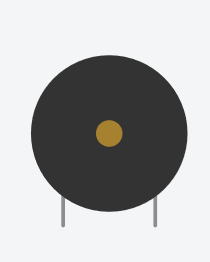

Piezo Speaker are usually use for lo fidelity sound, like door bell.

## Proximity Sensor
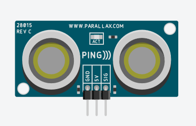

Usually come in 2 types, Ultrasonic and IR. Ultrasonic sensors use waves to determine the distance of an object. IR Sensors can be used to tell the distance, but also operate as a digital sensor, telling the user whether a person or object is in the space.
