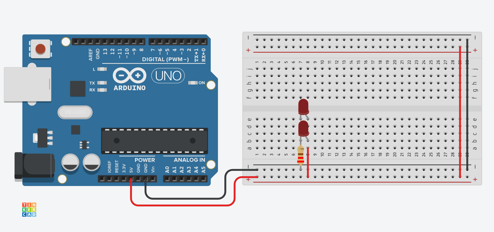
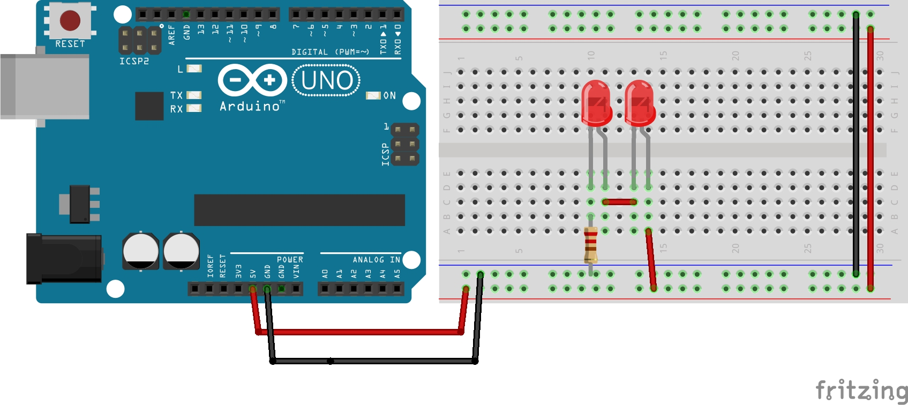

# Series and Parallel

## Parallel

In a parallel circuit, the voltage across each of the components is the same, and the total current is the sum of the currents through each component.

## Series

In a series circuit, the current through each of the components is the same, and the voltage across the circuit is the sum of the voltages across each component.

