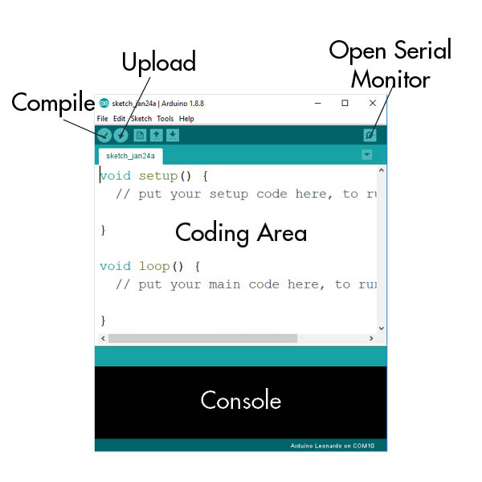

# Setting Up Your Environment

## Arduino IDE

Arduino as well as the software comes with its own text editor that also allows you to upload to the arduino boards

* [Arduino](https://www.arduino.cc/)
* [Software](https://www.arduino.cc/en/Main/Software)
* [Reference](https://www.arduino.cc/en/Reference/HomePage)

### Important Menu Items

* Preferences
  * Set Sketchbook Location
* Sketch
  * Verify/Compile
  * Upload
  * Include Library
* Tools
  * Auto Format - Cleans up whitespace in code
  * Serial Monitor - Opens window to view Serial messages, used for debugging.
  * Board - Before uploading select your board. This insures the proper code is upload to your microcontroller
  * Port - Sets the communication port. On windows machines, ports are referenced as COM, on OSX/Linux ports are referenced as tty or cu

## What is a Text Editor

A text editor is a type of program used for editing plain text files. Whether you are writing for html or another programming language, you will use a text editor to write your code.

### Why not use Word or TextEdit

The reason we use a text editor is that they allow use to write our code with no extra markup. When you use Word or TextEdit they normally add extra information into the file for encode things like bold, spacing, fonts, etc. Also with Word, for example, you generally save as a docx extension. With a text editor you can save as multiple file types.  

[Download Atom](https://atom.io/)

[Intro to Atom and Github](https://vimeo.com/251367070)
