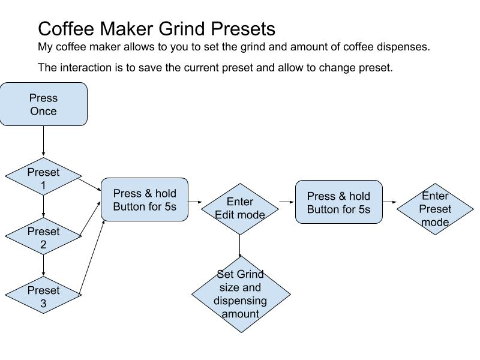

# Physical Computing: CIM 542/642-R - Spring Semester 2020

### Instructor: Zevensuy Rodriguez
#### Class Time: TuThu, 2:00-3:15pm
#### Class Site: https://github.com/zevenrodriguez/CIM542-642
#### Office: Francis L. Wolfson Building 2014
#### [Office Hours](https://outlook.office365.com/owa/calendar/OfficeHours@miamiedu.onmicrosoft.com/bookings/)
#### Email: zevenrodriguez@miami.edu
<!-- #### [Syllabus](https://github.com/zevenrodriguez/CIM542-642/blob/master/CIM542-642-R-Physical%20Computing.pdf) -->
#### [Syllabus Updated](https://github.com/zevenrodriguez/CIM542-642/blob/master/CIM542-642-R-PhysicalComputing-Updated.pdf)
#### [Notes](/Notes)

<!-- # [2019 Canes Film Festival Interactive End of Year Show TBA]() -->

## Tools

### Arduino Kit
* [Alternate Kit](https://www.amazon.com/ELEGOO-Project-Tutorial-Controller-Projects/dp/B01D8KOZF4?ref_=ast_sto_dp)
* [Official Kit](https://www.amazon.com/Arduino-Starter-Kit-English-Official/dp/B009UKZV0A/ref=sr_1_4?ie=UTF8&qid=1516635157&sr=8-4&keywords=arduino+starter+kit)
* [School Outfitters](http://www.schooloutfitters.com/catalog/product_info/pfam_id/PFAM53854/products_id/PRO72470?sc_cid=Google_ARD-K000007&adtype=pla&kw=&CAWELAID=320012570000053078&CAGPSPN=pla&CAAGID=45125248000&CATCI=pla-313518166499)

### Important Resources
* [Official Arduino Website](http://www.arduino.cc)
* [Learn Electronics with Arduino: An Illustrated Beginner's Guide to Physical Computing by Jody Culkin, Eric Hagan](https://www.amazon.com/Learn-Electronics-Arduino-Illustrated-Technology/dp/1680453742/ref=sr_1_18?keywords=arduino+book&qid=1578868522&sr=8-18)
* [ArduinoToGo Website](http://arduinotogo.com/)
* [UM Interactive Labs Site](https://uminteractive.github.io/labs/)

<!-- ## Canes Film Festival Interactive End of Year Show

At the end of the Spring Semseter, the Interactive Media Department invites students to participate in the Canes Film Festival End of Year Show. Students enrolled in this class must participate in the show. -->

## Assignments

 You will need to document your work for this class. Documentation must include videos/gifs, Images, and basic write ups about your projects. You will have 3 projects in this class. Each project should have its own documentation page. For smaller homework assignments, simply create a homework page and include all documentation there. All please upload all assignment links to Microsoft Teams before the date due.

# Class Schedule

### Week 1: Jan 14th-16th - Intro to Physical Computing, Intro to Basic Fabrication

* [Intro to Physical Computing Slides](https://docs.google.com/presentation/d/10FzMQ9X0vp3fHtjppiglLnoRbPExrV5GD2Lb1tUf4Sk/edit?usp=sharing)
* [Intro to Making](https://docs.google.com/presentation/d/1MiBCTzbZGxv1FeldpkSnju3gEhyvfKCOVmJnf68VY-A/edit?usp=sharing)
* [Vinyl Cutter Notes](https://uminteractive.github.io/labs/vinylcutter.html)
* [Project 1: Representing Emotion](https://github.com/zevenrodriguez/CIM542-642/blob/master/assignments.md)

### Week 2: Jan 21th-23rd - Getting Started with Arduino, Basic Electricity and Electronics

#### Notes

* [Intro to Electricity and Components Slides](https://docs.google.com/presentation/d/1OZsjOAGmvX9IuKPb8RYilajWWwStS34MV0bU8o1sHWA/edit?usp=sharing)
* [Intro to Arduino Kit](/Notes/Parts.md)
* [Intro to Arduino IDE](/Notes/Intro-to-Arduino.md)
* [Digital input and output](/Notes/Digital-IO.md)

#### Reading

* [Parts of an Arduino](http://arduinotogo.com/2016/08/20/chapter-1-parts-of-an-arduino/)
* [Plugging in your Arduino](http://arduinotogo.com/2016/08/20/chapter-1-plug-in-your-arduino/)
* [Using a Breadboard](http://arduinotogo.com/2016/08/22/chapter-2-using-a-breadboard/)
* [Programming the Arduino](http://arduinotogo.com/category/chapter-3/)
* [Github Notes](/Notes/Github.md)

#### Homework

Complete the [SOS Signal example in Chapter 3](http://arduinotogo.com/2016/09/09/chapter-3-sos-signal/)

* Document/record a video/gif of finished project
  * Create a hw page and embed video/gif
* Create a documentation page for Representing Emotion Project
  * Include a title with your Emotion
  * Design a new light pattern for your Emotion
  * Document/record your new light pattern
  * Upload code and Include Link

### Week 3: Jan 28th-30th - Representing Emotion Work Week

### Week 4: Feb 4th-6th – Lights and Animation

### Week 5: Feb 11th-13th -  Project Presentation

* [Digital input and output](/Notes/Digital-IO.md)
* Millis
* [Fade](https://github.com/zevenrodriguez/CIM542-642/blob/master/arduino/millisFadeUpDown/millisFadeUpDown.ino)
* Basic Switch - Examples => Basics => DigitalReadSerial
* [Mode Changer](https://github.com/zevenrodriguez/CIM542-642/blob/master/arduino/ModeChanger/ModeChanger.ino)
* [Light Pattern](https://github.com/zevenrodriguez/CIM542-642/blob/master/arduino/lightPattern/lightPattern.ino)
* Presentation Feb 13th
  * Sculpture
  * Light Pattern

### Week 6: Feb 18th-20th – Introduction to Analog Input/Output

* [Light Pattern](https://github.com/zevenrodriguez/CIM542-642/blob/master/arduino/lightPattern/lightPattern.ino)
* [Millis Fade](https://github.com/zevenrodriguez/CIM542-642/blob/master/arduino/millisFadeUpDown/millisFadeUpDown.ino)
* Representing Emotion Project Due Feb 20th
  * Bring finished product
  * All documentation due end of day

#### Reading
* [Add a button](http://arduinotogo.com/2016/10/08/chapter-5-add-a-button/)
* [Looking at Variables](http://arduinotogo.com/2016/10/08/chapter-5-looking-at-the-sketch-variables/)
* [Digital Input](http://arduinotogo.com/2016/10/08/chapter-5-digital-input/)
* [Conditionals](http://arduinotogo.com/2016/10/08/chapter-5-looking-at-the-sketch-conditional-statements/)

### Week 7: Feb 25th-27th – Analog Input/Output Cont’ & Intro to 3D Design/Printing

* [Intro to Motors](/Notes/Transistors-And-Motors.md)
* Servo Sweep Example - Examples => Servo => Sweep
* Servo Knob Example - Examples => Servo => Knob

#### Reading
* [Analog Input and Output](http://arduinotogo.com/category/chapter-6/)

### Week 8: Mar 3rd-5th – 3D Design Workshop

* [Intro to 3D Design](/Notes/Intro-to-3D-Design.md)
* [Intro to FDM](https://www.3dhubs.com/knowledge-base/introduction-fdm-3d-printing/)
* [Types of Design Software](https://www.3dhubs.com/knowledge-base/3d-modeling-cad-software)
* [Fasteners](https://docs.google.com/presentation/d/15S8b3iE_vphgxRu_Pq7GMbx549w8rgUJcG1xYuAcuhg/edit?usp=sharing)
* [Using Calipers](https://littlemachineshop.com/Instructions/UsingCalipers.pdf)
* [Dimension Worksheet](/files/DimensionWorksheet.pdf)
* [Sketching Fundamentals](https://learn.onshape.com/courses/fundamentals-sketching)

## Virtual Learning

The class will be a flip classroom. I will post video lectures or assignments before class and during class we will have office hours. I will be available only through teams. I would like to keep emailing to a minimum to make sure that all questions get answered. If you have general questions, use the general chat. If you have specific questions, feel free to send me a message. Teams has a great feature to do screen sharing, FYI. If you are not available for class due to time zone issues, please reach out to make arrangements.

* Online lecturers will be available before class
* Check in periodically for updates on assignments and lectures
* Office hours during class time
* Install Microsoft Teams Desktop

### Week of March 23rd – Re-intro to 3D Design and [Tinkercad](https://www.tinkercad.com/)
* [Intro to Tinkercad Video](https://miamiedu-my.sharepoint.com/:v:/g/personal/z_rodriguez2_umiami_edu/ETD8FneCD8JJlh3x-NXnZtEBMKy9SkwCUCta32ZuSvIbCA?e=UI5wLt)
### Week of March 30th – [Playful Interfaces Design Workshop](https://github.com/zevenrodriguez/CIM542-642/blob/master/assignments.md#project-2-playful-interfaces)
### Week of April 6th - [Playful Interfaces Programming Workshop](https://github.com/zevenrodriguez/CIM542-642/blob/master/assignments.md#project-2-playful-interfaces)
### Week of April 13th – [Playful Interfaces Projects Due](https://github.com/zevenrodriguez/CIM542-642/blob/master/assignments.md#project-2-playful-interfaces), [Helping Robots Project Introduction](https://github.com/zevenrodriguez/CIM542-642/blob/master/assignments.md#project-3-helping-robots)
### Week of April 20th - [Helping Robots Design](https://github.com/zevenrodriguez/CIM542-642/blob/master/assignments.md#project-3-helping-robots)
### Week of April 27th - [Helping Robots Programming](https://github.com/zevenrodriguez/CIM542-642/blob/master/assignments.md#project-3-helping-robots)
### Week of May 4th - [Helping Robots Due](https://github.com/zevenrodriguez/CIM542-642/blob/master/assignments.md#project-3-helping-robots) - Spring semester ends on May 6

<!--
### Week 9: Mar 17th-19th – Toy Workshop

### Week 10: Mar 24th-26th – Toy Presentation

### Week 11: Mar 31st-Apr 2nd – Final Ideation Workshop

### Week 12: Apr 7th-9th - Fabrication Workshop

### Week 13: Apr 14th-16th – Programming Workshop

### Week 14: Apr 21st-23rd – Project Workshop

### End of Year Show TBA

## IMPORTANT DATES:

Jan 13 - CLASSES BEGIN

Jan 20 - HOLIDAY (MARTIN LUTHER KING, JR. DAY)

March 7-15 - SPRING RECESS

March 25 - Last Day to Drop a Course

April 24 - CLASSES END  (11:00 PM)

April 25 - April 28 - Reading Days

April 29- May 6 - FINAL EXAMS -->

<!--

### Week 1: Class Introduction

* Class intro
* Intro to Arduino
* Ideation Workshop: Crazy Machine - Create a fantasy machine that a user can interact with.

#### HW 1
* Create an interface for your machine using the [Storyboard Worksheet](files\StoryboardWorksheet.pdf)
  * Use the parts worksheet to prototype your machine. You can choose to prototype a particular aspect of your machine.
* [Student Survey](https://goo.gl/forms/1YEsS1fAeXefNjHO2)
* Buy Arduino Kit
  * [Arduino.cc](https://store.arduino.cc/usa/arduino-starter-kit)
  * [Amazon](https://www.amazon.com/Arduino-Starter-Kit-English-Official/dp/B009UKZV0A/ref=sr_1_4?ie=UTF8&qid=1516635157&sr=8-4&keywords=arduino+starter+kit)

#### Week 2: Intro to Physical Computing, Basic Electricity and Electronics

* [Intro to Electricity and Components Slides](https://docs.google.com/presentation/d/1OZsjOAGmvX9IuKPb8RYilajWWwStS34MV0bU8o1sHWA/edit?usp=sharing)
* Intro to Arduino Kit
* [Intro to Arduino IDE](/Notes/Intro-to-Arduino.md)
* [Digital input and output](/Notes/Digital-IO.md)

##### HW 2:

* Lab - Spaceship Interface [Video Link](https://www.youtube.com/watch?v=xTXjsC78RSQ&index=2&list=PLT6rF_I5kknPf2qlVFlvH47qHvqvzkknd)

#### Week 3: Getting Started with Arduino, Digital Input/Output

* [Digital input and output](/Notes/Digital-IO.md)
* [Series vs Parallel](/Notes/Series-vs-Parallel.md)
* [Variables](/Notes/Variables.md)
* [Debugging](/Notes/Debugging.md)
* Introduction to logic flow

##### HW 3:

  * User Flow
    * How can you create an interface with one button interface and an led? Take a minute and observe your surroundings. Find piece of electronics that you can augment/add a feature with a button and an led. Think about modes and outputs to express an action and reaction. Create a flow using Google’s drawing app to explain how a user interacts with your interface.
      * Microwave
      * Coffeemaker
      * TV

  

#### Week 4: Analog Input/Output

* [Analog IO](Notes/Analog-IO.md)

##### HW 4:

* Make and Document the Love-O-Meter and Color Mixing Lamp

#### Week 5: [Advanced Programming](Notes/Advanced-Programming.md)

* [Theremin](https://github.com/zevenrodriguez/CIM542-642/blob/master/arduino/theremin/theremin.ino)
* [Temperature](https://github.com/zevenrodriguez/CIM542-642/blob/master/arduino/temp/temp.ino)

#### Week 6: [Servos, Transistors, and Motors](Notes/Transistors-And-Motors.md)

* millis
  * [fade in/fade out](../arduino/millisFadeUpDown/millisFadeUpDown.ino)
* [Servo](../arduino/servoKnob/servoKnob.ino)

##### HW 5:
* Knock Lock
* Sensor Walk - Go to a public area, A park, Food Court, Mall, Etc
  * Find 6 points of interaction between people and electronics, mechanical devices, signage, or any other areas of high traffic
  * What are the inputs?
    * Find switches, levers, buttons, visual aids
    * Are the inputs active(electronic or mechanical) or passive
      * If Active
        * What is the sensor?
        * What triggers the sensor?
      * If Passive
        * What is the User doing?
        * Are they walking up?
   * What are the outputs?
     * Lights, sound, motors, signage
     * Is the output active or passive
       * If Active,
         * What does it do when triggered?
       * If Passive
         * What is it?
           * Map
           * Sign
* Research Parts
  * Based on 3 inputs/outputs from the Sensor Walk, research potential sensors used in the input or output
  * Search in [amazon](https://www.amazon.com/), [adafruit](https://www.adafruit.com/), and [sparkfun](https://www.sparkfun.com/), [robotshop](https://www.robotshop.com/) for potential matches

#### Week 7: [Ideation Lab](https://github.com/zevenrodriguez/CIM542-642/wiki/Midterm)

##### HW 6:

* 5 Slide intro
  * What is your Project?
    * Describe your project in 1-2 sentences
  * 3 Projects that influenced yours
    * Explain how
    * Include an Image and Link
  * What parts did you use?
    * Parts List Worksheet
  * Explain your interaction
    * Ie - Flow Diagram
  * What modifications would make to you project
    * Q and A Worksheet

#### Week 8: Midterm Lab

* Midterm Presentation
* Midterm Lab

##### Requirements for Midterm and Final - 100 points

* Create a folder for your midterm.
  * Include a readme.md in your folder.
    * Answer the questions below - 20 Points
  * Include Images and Video - 20 Points
  * Include your code - 20 Points
  * Your project needs to be encased - 20 Points

###### About the project
* What is the title of your project?
* Briefly explain why did you want to make this project?
  * Who are the stakeholders?
  * Find 3 inspiring projects

###### Code

* How does your program work? (Explain your code)
  * Reflection
    * What worked/did not work?
    * If you had more time what would you change in your project?

###### Components

* What parts did you use?
* Which are your inputs/outputs

###### Interaction

* Explain how a user interacts with your input/output
  * Create a layout for your interface
  * Storyboard the interaction
    * Draw a step by step diagram of the interaction
    * Explain how the project is used?
      * How does the user interact with the input
      * Why did you decide to use that component?
      * Explain how the input translates to the output
* Talk about what form factor/size your project would ideally be.

###### Images and Videos
* Include images and captions for
  * 2 - Progress images
    * For example, breadboard, case,
  * 1 - Finished input
  * 1 - Finished output
  * 1 - Finished Breadboard
* A video of finished project

#### Week 9: Spring Break

#### Week 10: Midterm Due, [Intro to Making](https://github.com/zevenrodriguez/CIM542-642/wiki/Intro-to-3D-Design)

#### Week 11: Intro to 3D Design

For the video tutorials and onshape works best on google chrome.

* [Intro to Onshape](https://www.onshape.com/videos/software-overview-and-user-interface-tour)
* [Complete Fundamentals of Sketching](https://learn.onshape.com/learn/course/fundamentals-sketching)
  * Starting a Sketch
  * Lines and Rectangles
  * Construction Geometry
* [Complete Fundamentals of Part Design](https://learn.onshape.com/learn/course/fundamentals-part-design-using-part-studios)
  * Starting a part
  * Extrude
  * Appearance
* [Using Calipers](https://littlemachineshop.com/images/gallery/Instructions/UsingCalipers.pdf)

#### HW Due April 11th

* Midterm Paper Prototype
  * Create an enclosure or part using the Vinyl Cutter
* [Complete the DimensionWorksheet](files/DimensionWorksheet.pdf)
* 2 - 3D Printed objects (Parts must be designed and printed before class)
  * Create 2 small 3D Printed objects
    * Create a custom cap for a switch or
    * Create a custom knob for a potentiometer or
    * Create custom pieces for your final
* #### Turning in your assignment
  * In your main readme,
    * Upload and include your images of all your new made pieces
      * Add caption/text for context
    * Upload and Link your Dimension Worksheet

#### Week 12: 3D Design Continued, Ideation Lab

#### Week 13: Making Lab

#### Week 14: Apr 16th - Final Lab

#### Week 15: Apr 23th - Final Presentation

# [Interactive Media End of Year Show - May 2nd 5 PM](https://interactive.miami.edu/canesfilmfestival/)
# Final Due May 7th 2-4:30 PM

-->
